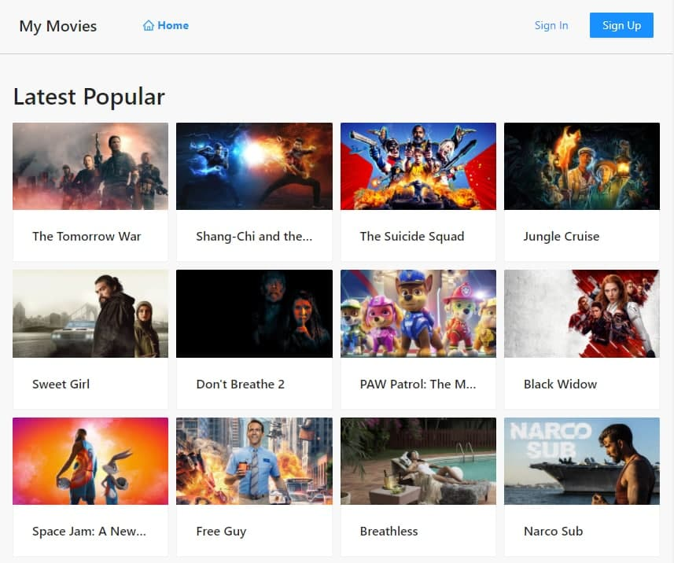
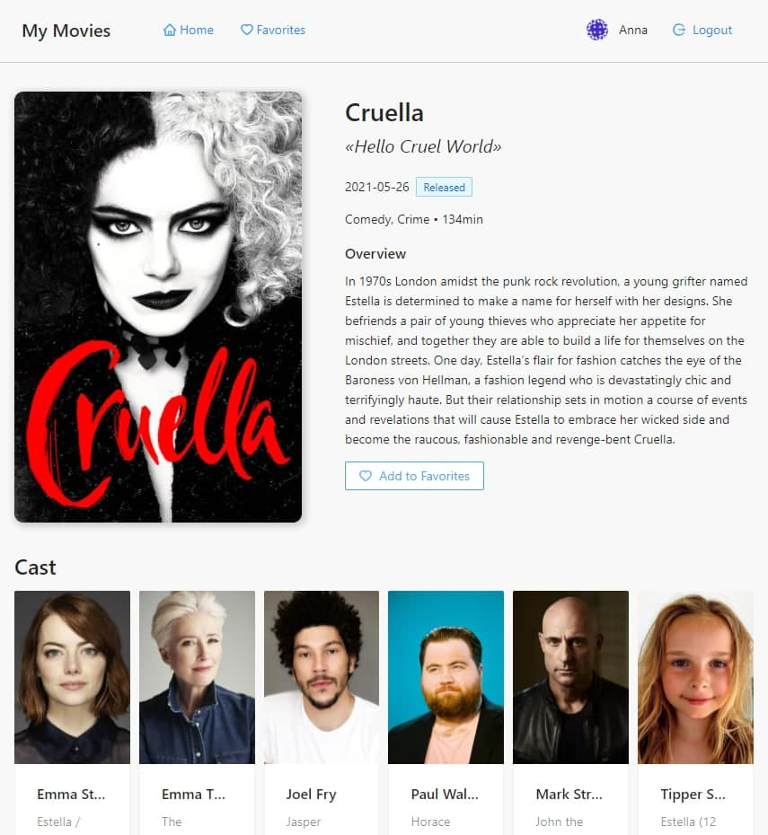
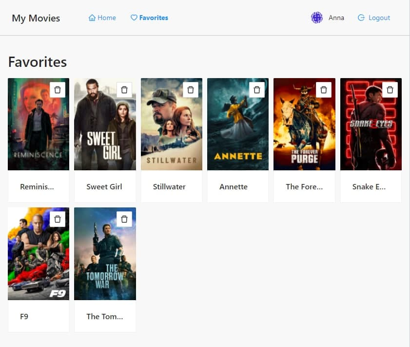

# My Movies App

Приложение-каталог фильмов

## Features
В приложении можно просматривать карточки фильмов. 
Также есть возможность зарегистрироваться и добавлять фильмы в избранное (и удалять, соответственно)

- Главная



- Страница фильма



- Избранные



## Tech
- React JS, NodeJS, Express, MongoDB
- UI: [Ant Design](https://ant.design/components/overview/)
- API для работы с фильмами: [The Movie Database (TMDB) API](https://developers.themoviedb.org/3)

## Для запуска приложения:

- установить зависимости в корневой директории
```sh
npm i
```

- установить зависимости в директории client
```sh
cd client
npm i
```
- запуск локально в dev-режиме
```sh
npm run dev
```


### P.S. Идеи развития
#### Features
- Профиль пользователя
- Возможность для пользователя выбирать любимые жанры, на основе этого формировать подборки фильмов на главной странице

#### Tech
- Typescript
- CSS-модули
- Покрытие тестами
